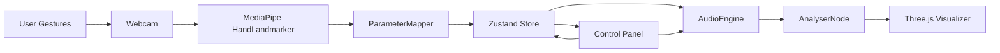

# Circuit Symphony Overview

Interactive WebAudio + Three.js playground controlled by MIDI/gestures. Built with Vite + React 18, Zustand state, MediaPipe Hands, and instanced-mesh visualizers.

## Flow

- `Hand` = `src/gestures/HandDetector.ts` streaming landmarks.
- `Map` = `src/gestures/ParameterMapper.ts` mapping distance/spread → frequency/Q/gain.
- `Store` = `src/state/useAppStore.ts` single source of truth for mode/waveform/params.
- `Audio` = `src/audio/AudioEngine.ts` oscillator → biquad → gain → analyser graph.
- `Viz` = `src/visualization/Visualizer.tsx` + `ParticleWaveform` + `SpectrumVisualizer`.
- `UI` = `src/components/ControlPanel.tsx` for manual control and accessibility.

## Modules
- **AudioEngine**: starts `AudioContext`, oscillator, filter, gain, analyser; smooth parameter setters.
- **Filter Designer**: helpers for RC/Butterworth/Chebyshev prototypes (`src/audio/filterDesigner.ts`).
- **Signal Generator**: waveform builders, incl. harmonic series (`src/audio/signalGenerator.ts`).
- **Gestures**: MediaPipe Hands wrapper + parameter mapper.
- **Visualization**: Instanced meshes for waveform particles and spectrum bars; bloom postprocess.
- **State**: Zustand store for UI + audio params, including analyser smoothing and mode.

## Keyboard/Accessibility
- All sliders/buttons focusable; start is a button for screen readers.
- Gesture control optional; manual controls always available.

## Limits
- Webcam requires HTTPS (or localhost).
- Gestures run on requestAnimationFrame; expect ~30–60fps with modern hardware.
